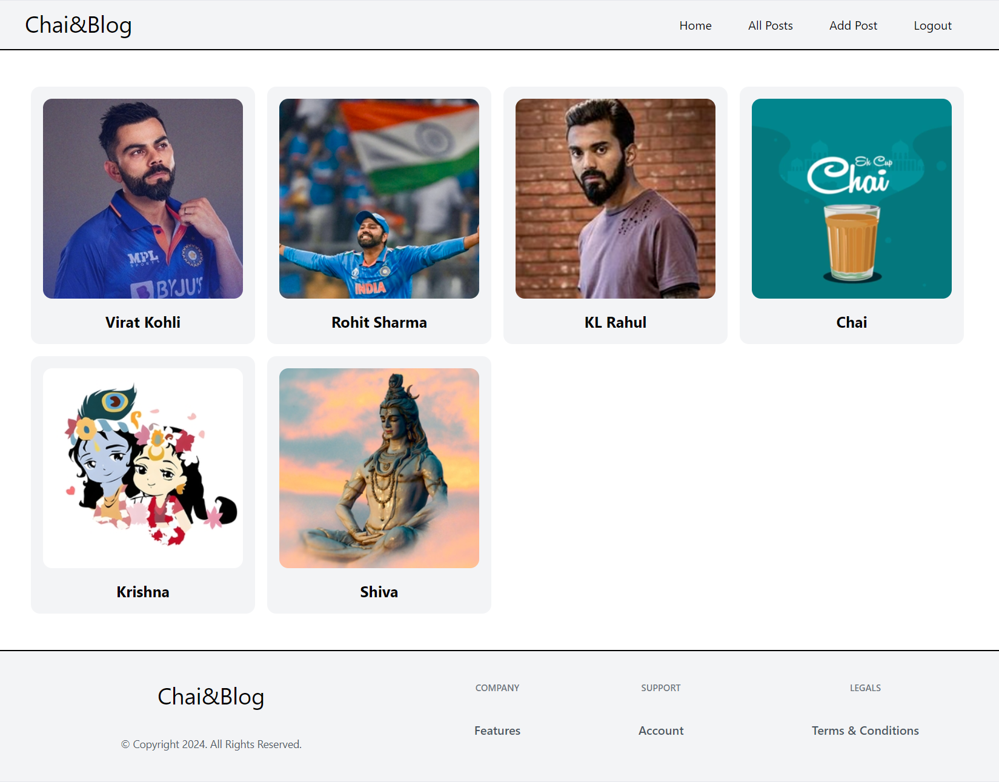

# Blog Website ✍️

## Description 📝

This is a simple yet powerful blog website built using Vite and React for the frontend, Appwrite as a backend-as-a-service, Tailwind for styling, and deployed on Vercel. The application allows users to create, read, update, and delete blog posts with images. (A Project from Chai☕ and React)

## Tech Stack ⚙️

- **Frontend:**
  - Vite
  - React
  - Tailwind CSS

- **Backend:**
  - Appwrite (Backend-as-a-Service)

- **Deployment:**
  - Vercel

## Features ✨

- **CRUD Operations:**
  - Create, Read, Update, and Delete blog posts.
  - Upload and display images associated with each post.

- **Authentication:**
  - User authentication powered by Appwrite.
  - Secure access to create, update, and delete posts.
 
## Snap 🖼️

## Contributions 🤝

All contributions are welcome and appreciated! If you find any issues (there are many btw), have suggestions, or want to add new features, you are welcome to create a PR.
Thank you in advance for contributing to this project! 🚀

## Note:
Account needs to be verified after creation which hasn't been handled yet in the deployment, hence it can take time.

You can use this verified account till then to explore - Email : blog@chai.com, Password : ☕@123

## Connect 

## 
### Leave a 🌟 if it was Helpful!!
### Thanks!
